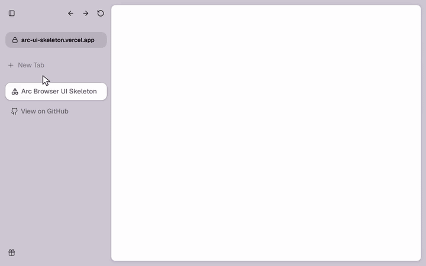
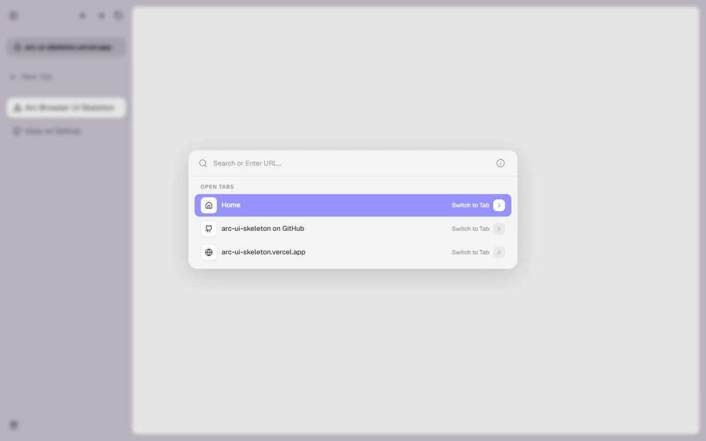

# Arc UI Skeleton

An Arc-inspired browser interface built as a Next.js web app, with a collapsible sidebar, page frame, and URL command menu.

## Demo



<details>
<summary>Screenshot</summary>



</details>

[Live demo](https://arc-ui-skeleton.vercel.app)

## What it does

- Open the URL command menu to enter an address or search query.
- Collapse the sidebar and reveal it through a hover peek.
- Explore the sidebar, downloads rail, and page frame components.

## Run locally

Use Node.js 20.9+ and Bun.

```bash
git clone https://github.com/SpyC0der77/arc-ui-skeleton.git
cd arc-ui-skeleton
bun install --frozen-lockfile
bun run dev
```

Open [localhost:3000](http://localhost:3000).

## Commands

| Command | Purpose |
| --- | --- |
| `bun run dev` | Start the development server |
| `bun run build` | Build the production app |
| `bun run start` | Serve a production build |
| `bun run lint` | Run ESLint |

Run `build` before `start`.

## Dependencies and limitations

This is a browser UI prototype running inside a web page. It does not embed a browser engine or provide browser-level tab isolation, extensions, or download management. Navigation actions use ordinary web links.

## Source layout

- [`app/page.tsx`](app/page.tsx): Interface composition.
- [`components/sidebar/`](components/sidebar/): Sidebar and hover behavior.
- [`components/arc-url-command-menu.tsx`](components/arc-url-command-menu.tsx): Address/search command menu.
- [`components/home-page-frame.tsx`](components/home-page-frame.tsx): Page frame.
